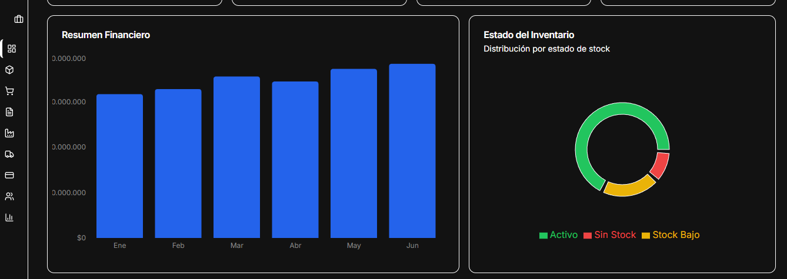

<div align="center">

# AuraERP

**ERP de código abierto · adaptable, modular y listo para producción**

<p align="center">
&nbsp;&nbsp;
&nbsp;&nbsp;
&nbsp;&nbsp;
&nbsp;&nbsp;
&nbsp;&nbsp;
&nbsp;&nbsp;
&nbsp;&nbsp;
</p>

## 🚀 Visión general

AuraERP es un **ERP moderno 100% open-source** construido con el stack más actual (Next.js 16 App Router, React 19, TypeScript, Tailwind CSS, Radix UI y Recharts) y una arquitectura ultra-simple basada en **JSON + localStorage**.



</div>

Perfecto para:
- Empresas pequeñas y medianas que buscan un ERP real sin pagar licencias
- Desarrolladores que quieren forkear y personalizar cada módulo
- Aprender cómo se construye un ERP real con tecnologías actuales

## ✨ Características principales

| Módulo           | Funcionalidades clave                                      | Analítica incluida                     |
|------------------|------------------------------------------------------------|----------------------------------------|
| **Ventas**       | Órdenes SO-, estados, facturación, clientes               | Ventas mensuales · Distribución por estado |
| **Compras**      | Órdenes PU-, proveedores, fechas esperadas                 | Costos por período                     |
| **Inventario**   | Materias primas, en proceso, productos terminados          | Valorización · Rotación · Días de suministro |
| **Producción**   | Órdenes ORD-, lotes, turnos, planta, eficiencia           | Desperdicio · Downtime · OEE           |
| **Logística**    | Envíos SH-, tracking, transportistas                       | Estado de entregas                     |
| **Finanzas**     | Facturas INV-, ingresos/egresos, cuentas contables         | Utilidad bruta · Flujo de caja         |
| **RRHH**         | Empleados, ausencias, vacaciones, evaluaciones            | Promedio de desempeño dinámico         |
| **Reportes**     | Dashboard ejecutivo con más de 10 gráficos combinados      | ComposedChart · Área · Barras · Líneas · Pastel |

Todo con **formato colombiano (COP sin decimales)** y tooltips legibles.

## 🎮 Demo en 30 segundos

```bash
git clone https://github.com/AuraErp/Auraerp.git
cd Auraerp
npm install
npm run dev
```

→ Abre [http://localhost:3000](http://localhost:3000)

## 🏗️ Arquitectura (simple y extensible)

```
app/                → Páginas por módulo (App Router)
components/         → Componentes UI + dashboards (Radix + Tailwind)
data/               → Seeds JSON reales (ventas, compras, producción, etc.)
lib/storage.ts      → useLocalStorage + modelos tipados
```

- Persistencia automática con `localStorage` versionado
- Seeds actualizables sin perder datos del usuario
- Reportes centralizados en `app/reports/page.tsx`

## 🎨 Personalización ultra fácil

- **UI**: Tailwind + Radix → coherencia total
- **Datos**: extiende las interfaces en `lib/storage.ts`
- **Nuevos módulos**: copia uno existente y cambia la clave de storage
- **Reportes**: agrega series a `historical-data.json` y renderiza

## 🔮 Roadmap 2026

- [ ] Autenticación + multiusuario
- [ ] Backend opcional (PostgreSQL + Prisma)
- [ ] Roles y permisos granulares
- [ ] Exportación Excel/PDF profesional
- [ ] Modo oscuro completo
- [ ] App móvil (React Native / Expo)

## 🤝 Contribuir

¡Tu aporte es bienvenido!

```bash
git checkout -b feat/nuevo-modulo
# Mantén Tailwind + Radix + useLocalStorage pattern
git commit -m "feat: añade módulo contabilidad avanzada"
```

PRs con descripción clara → merge rápido.

## 📄 Licencia

**MIT** — úsalo, modifícalo, véndelo, regálalo. ¡Libre total!

---

<div align="center">

**¿Listo para tener tu propio ERP sin pagar miles de dólares al mes?**  
⭐ **Dale star si te gusta** · 🚀 **Forkea y personalízalo hoy**

</div>
